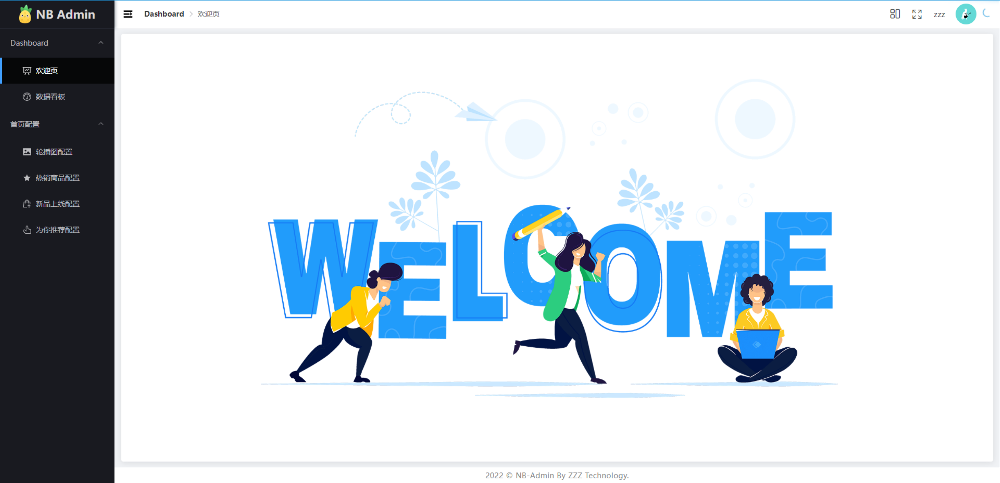

# new_bee_admin 项目构建
## 项目介绍
> new_bee项目为后台管理项目  能够管理new_bee商城内容 【商品、轮播图、商品推荐、商品订单、购物车】

## 项目主要使用技术点
+ Vue3
+ TypeScript
+ Vite2
+ Vue-Router 4
+ Pinia
+ Element-Plus
+ Echart5
+ Axios

## 项目主要功能
+ Dashboard 数据看板
+ 商品管理
	+ 上架 / 下架 
	+ 添加
	+ 删除
	+ 修改
+ 首页营销管理
	+ 轮播图
	+ 推荐商品
	+ 热销商品
	+ 新品上线
+ 分类管理
	+ 一级 / 二级 / 三级
	+ 修改 删除
+ 会员管理
	+ 商品会员
	+ 会员禁用
+ 订单管理
	+ 订单查询
	+ 发货
	+ 关闭
	+ 详情
+ 系统管理
	+ 用户名修改
	+ 登录密码修改

## 项目接口API
+ 接口文档采用 swaggerUI 自动生成 :  
	`http://zhi.zeng.pub/new-bee/swagger-ui/index.html`

+ 接口地址: `http://zhi.zeng.pub/new-bee/`

## 项目功能演示
(-.-)  `演示地址 暂未部署`  (-.-)

+ 登录页

+ 首页

