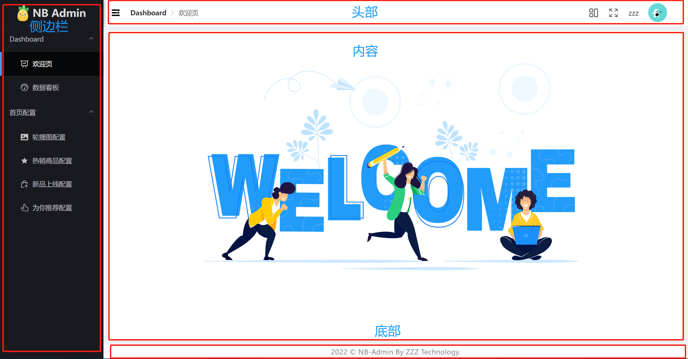

# 布局搭建
> 该章节主要讲解 从0开始搭建后台管理项目

# 1. 布局结构分析


从图片上可得项目主体布局由： **侧边栏 + 右侧栏（头部、内容、底部）** 组成

# 2. 路由设计
+ `<router-view><router-view>`  路由容器
	+  `<aside></aside>`   侧边栏
	+  `<right-main><right-main>` 右侧内容
		+ `<header></header>`	头部
		+ `<main></main>`			内容
			+ `<router-view><router-view>` 路由容器
		+ `<footer></footer>` 底部

> + 最外层由路由容器做占位 进而页面有大变化可以动态调整
> + 右侧内容由路由容器占位 保证页面右侧动态变化


# 3. 样式初始化

在 ` main.ts` 中

+ 字体图标导入 （后续需要使用）  建议放入 assets目录

+ 重置css导入  `reset.scss`  

+ 公用css导入 `common.scss`

+ elementUI图标初始化  **element图标已更新为组件 需要额外导入** 

  安装： `pnpm install @element-plus/icons-vue`

  ``` typescript
  // ElementIcon
  import * as Icons from '@element-plus/icons-vue'
  
  // 注册element Icons组件
  Object.keys(Icons).forEach(key => {
  	app.component(key, Icons[key as keyof typeof Icons])
  })
  ```

  

**css具体代码会在素材区域提供**


# 4. 布局组件编写

## 4.1 Layout组件

+ 新建 `layout/index.vue` `layout/index.scss`

``` vue
<script setup lang="ts" name="Layout">
	import Menu from './Menu/index.vue'
	import Header from './Header/index.vue'
	import Footer from './Footer/index.vue'
</script>

<template>
	<!-- 布局容器 -->
	<el-container>
		<!-- 左侧 -->
		<el-aside>
			<Menu></Menu>
		</el-aside>
		<!-- 右侧 -->
		<el-container>
			<!-- 右侧头部 -->
			<el-header><Header /></el-header>
			<!-- 右侧内容 -->
			<el-main>
				<section class="main-box">这是内容</section>
			</el-main>
			<!-- 右侧底部 -->
			<el-footer><Footer /></el-footer>
		</el-container>
	</el-container>
</template>

<style scoped lang="scss">
	@import './index.scss';
</style>
```

``` scss
.el-container {
	display: flex;
	width: 100%;
	min-width: 970px;
	height: 100%;
	// 侧边栏
	.el-aside {
		width: auto;
		overflow: inherit;
		background-color: #191a20;
	}
	// 主体内容
	.el-header,
	.el-footer {
		height: auto;
		padding: 0;
	}
	.el-main {
		box-sizing: border-box;
		padding: 10px 13px;
		// 防止切换出现横向滚动条
		overflow-x: hidden;
		background: #f0f2f5;
		.main-box {
			box-sizing: border-box;
			width: 100%;
			min-height: 100%;
			padding: 20px;
			overflow: auto;
			overflow-x: hidden !important;
			background-color: #ffffff;
			border-radius: 4px;
			box-shadow: 0 2px 12px 0 rgb(0 0 0 / 10%);
			// 设置滚动条颜色
			&::-webkit-scrollbar {
				background-color: white;
			}
		}
	}
}
```

+ 新建 `Header` `Menu` `Footer` 组件内容随意

## 4.2 路由修改

+ 修改`router`文件

``` ts
import { createRouter, createWebHistory } from 'vue-router'
import Layout from '@/layout/index.vue'

const router = createRouter({
	// history 配置路由模式 createWebHistory【history模式】  createWebHashHistory【hash模式】
	history: createWebHistory(),
	routes: [
		{
			path: '/',
			component: Layout
		}
	]
})

export default router
```

+ 修改 `app.vue`

``` vue
<script setup lang="ts"></script>

<template>
	<router-view></router-view>
</template>

<style scoped></style>
```

## 4.3 二级路由修改

+ 在views目录下 新增 `dashboard`  以及  `home` 页面

home页面内容如下 **图片在资源库中**

``` vue
<script setup lang="ts" name="Home">
	// 这是HOME页面
</script>

<template>
	<div class="home flx-center">
		
	</div>
</template>

<style scoped lang="scss">
	@import './index.scss';
</style>
```

dashboard页面随意

+ 修改 router配置文件

``` typescript
// ...
routes: [
    // 首页模块
    {
        path: '/',
        component: Layout,
        redirect: '/home',
        children: [
            {
                path: '/home',
                name: 'home',
                component: () => import('@/views/dashboard/home/index.vue')
            },
            {
                path: '/dashboard',
                name: 'dashboard',
                component: () => import('@/views/dashboard/index.vue')
            }
        ]
    }
]
// ...
```

## 4.4 Menu组件

`Menu`组件主文件内容如下：

结构主要由: Logo  +  MenuNav 组成  

``` vue
<script setup lang="ts" name="Menu">
	import Logo from './components/Logo.vue'
</script>

<template>
	<div class="menu">
		<!-- Logo -->
		<Logo />
		<!-- 菜单栏 -->
		<el-scrollbar>
			<el-menu
				router
				default-active="/home"
				:unique-opened="false"
				background-color="#191a20"
				text-color="#bdbdc0"
				active-text-color="#fff"
			>
				<!-- 一级菜单 -->
				<el-sub-menu index="/">
					<!-- 文字 -->
					<template #title>
						<span>Dashboard</span>
					</template>
					<!-- 二级菜单 -->
					<el-menu-item index="/home">
						<!-- 图标 -->
						<el-icon><DataBoard /></el-icon>
						<!-- 文字 -->
						<template #title>
							<span>欢迎页</span>
						</template>
					</el-menu-item>
					<!-- 二级菜单 -->
					<el-menu-item index="/dashboard">
						<!-- 图标 -->
						<el-icon><DeleteLocation /></el-icon>
						<!-- 文字 -->
						<template #title>
							<span>数据看板</span>
						</template>
					</el-menu-item>
				</el-sub-menu>
			</el-menu>
		</el-scrollbar>
	</div>
</template>

<style scoped lang="scss">
	@import './index.scss';
</style>
```

``` scss
.menu {
	position: relative;
	display: flex;
	flex-direction: column;
	height: 100%;
	background-color: #191a20;
	transition: all 0.3s ease;
	width: 220px;
	.logo {
		box-sizing: border-box;
		height: 55px;
		border-bottom: 1px solid #282a35;
		box-shadow: 2px 0 6px rgb(0 21 41 / 35%);
		span {
			font-size: 22px;
			font-weight: bold;
			color: #dadada;
			white-space: nowrap;
		}
		img {
			width: 24px;
			object-fit: contain;
			margin-right: 8px;
		}
	}
	.el-scrollbar {
		height: calc(100% - 55px);
		.el-menu {
			flex: 1;
			overflow: auto;
			overflow-x: hidden;
			border-right: none;
			.el-menu-item {
				&.is-active {
					background-color: #060708 !important;
				}
				&.is-active::before {
					position: absolute;
					top: 0;
					bottom: 0;
					left: 0;
					width: 4px;
					content: '';
					// background: $primary-color;
					background: #409EFF;
				}
			}
		}
	}
}
```

`Logo`组件内容如下

``` vue
<script setup lang="ts" name="Logo"></script>

<template>
	<div class="logo flx-center">
		
		<span>NB Admin</span>
	</div>
</template>

<style scoped lang="scss">
	@import '../index.scss';
</style>
```

## 4.5 Header组件

`Header`组件  内容如下:

左侧： 伸缩侧边栏开关   面包屑

右侧： 调整开关    全屏开关    用户名    头像

+ 伸缩侧边栏开关   `CollapseIcon`

``` vue
<script setup lang="ts"></script>

<template>
	<el-icon class="collapse-icon">
		<Expand />
	</el-icon>
</template>

<style scoped lang="scss"></style>
```

+ 面包屑 `Breadcrumb`

``` vue
<script setup lang="ts" name="Breadcrumb">
	import { ArrowRight } from '@element-plus/icons-vue'
</script>

<template>
	<el-breadcrumb :separator-icon="ArrowRight">
		<transition-group name="breadcrumb" mode="out-in">
			<el-breadcrumb-item :to="{ path: '/' }" key="/">Dashboard</el-breadcrumb-item>
		</transition-group>
	</el-breadcrumb>
</template>
```

+ 调整开关 `AssemblySize`

``` vue
<script setup lang="ts">
	import { reactive, ref } from 'vue'

	const assemblySize = ref('default')

	const assemblySizeListCh = reactive<Record<string, any>>({
		default: '默认',
		large: '大型',
		small: '小型'
	})

	const setAssemblySize = (item: string) => {
		assemblySize.value = item
	}
</script>

<template>
	<el-dropdown trigger="click" @command="setAssemblySize">
		<span>
			<el-tooltip effect="dark" content="组件大小" placement="bottom">
				<i class="icon-style iconfont icon-contentright"></i>
			</el-tooltip>
		</span>
		<template #dropdown>
			<el-dropdown-menu>
				<el-dropdown-item v-for="(value, key) in assemblySizeListCh" :key="key" :disabled="assemblySize === key" :command="key">
					{{ value }}
				</el-dropdown-item>
			</el-dropdown-menu>
		</template>
	</el-dropdown>
</template>

<style scoped lang="scss">
	@import '../index.scss';
</style>
```

+ 全屏开关 `Fullscreen`

``` vue
<template>
	<el-tooltip effect="dark" :content="isFullscreen ? '退出全屏' : '进入全屏'" placement="bottom">
		<i :class="['iconfont', isFullscreen ? 'icon-suoxiao' : 'icon-fangda']" class="icon-style" @click="toggle"></i>
	</el-tooltip>
</template>

<script setup lang="ts">
	import { ref } from 'vue'

	const isFullscreen = ref(false)

	const toggle = () => (isFullscreen.value = !isFullscreen.value)
</script>

<style scoped lang="scss">
	@import '../index.scss';
</style>
```

+ 头像  `Avatar`

``` vue
<template>
	<el-dropdown trigger="click">
		<div class="avatar">
			
		</div>
		<template #dropdown>
			<el-dropdown-menu>
				<el-dropdown-item @click="openDialog('infoRef')">个人资料</el-dropdown-item>
				<el-dropdown-item @click="openDialog('passwordRef')">修改密码</el-dropdown-item>
				<el-dropdown-item divided>退出登录</el-dropdown-item>
			</el-dropdown-menu>
		</template>
	</el-dropdown>
	<!-- infoDialog -->
	<InfoDialog ref="infoRef"></InfoDialog>
	<!-- passwordDialog -->
	<PasswordDialog ref="passwordRef"></PasswordDialog>
</template>

<script setup lang="ts">
	import { ref } from 'vue'
	import InfoDialog from './InfoDialog.vue'
	import PasswordDialog from './PasswordDialog.vue'

	const infoRef = ref<null | InstanceType<typeof InfoDialog>>(null)
	const passwordRef = ref<null | InstanceType<typeof PasswordDialog>>(null)
	// 打开修改密码和个人信息弹窗
	const openDialog = (refName: string) => {
		if (refName == 'infoRef') return infoRef.value?.openDialog()
		passwordRef.value?.openDialog()
	}
</script>

<style scoped lang="scss">
	@import '../index.scss';
</style>
```

**用户信息组件 infoDialog**

``` vue
<template>
	<el-dialog v-model="dialogVisible" title="修改信息" width="500px" draggable>
		<span>这是用户信息</span>
	</el-dialog>
</template>

<script setup lang="ts">
	import { ref } from 'vue'
	const dialogVisible = ref(false)

	// openDialog
	const openDialog = () => {
		dialogVisible.value = true
	}

	defineExpose({
		openDialog
	})
</script>
```

**修改密码组件 PasswordDialog**

``` vue
<template>
	<el-dialog v-model="dialogVisible" title="修改密码" width="500px" draggable>
		<span>这是修改密码</span>
		<template #footer>
			<span class="dialog-footer">
				<el-button @click="dialogVisible = false">取消</el-button>
				<el-button type="primary" @click="dialogVisible = false">确认</el-button>
			</span>
		</template>
	</el-dialog>
</template>

<script setup lang="ts">
	import { ref } from 'vue'
	const dialogVisible = ref(false)

	// openDialog
	const openDialog = () => {
		dialogVisible.value = true
	}

	defineExpose({
		openDialog
	})
</script>
```

+ `Header` 主文件内容

``` vue
<script setup lang="ts" name="Header">
	import CollapseIcon from './components/CollapseIcon.vue'
	import Breadcrumb from './components/Breadcrumb.vue'
	import AssemblySize from './components/AssemblySize.vue'
	import Fullscreen from './components/Fullscreen.vue'
	import Avatar from './components/Avatar.vue'
</script>

<template>
	<div class="header">
		<!-- 左侧 -->
		<div class="header-lf flx-center">
			<!-- 扩展按钮 -->
			<CollapseIcon />
			<!-- 面包屑 -->
			<Breadcrumb />
		</div>
		<!-- 右侧 -->
		<div class="header-ri flx-center">
			<!-- 控制大小 -->
			<AssemblySize />
			<!-- 全屏 -->
			<Fullscreen />
			<!-- 用户名 -->
			<span class="username">zzz</span>
			<!-- 用户头像 -->
			<Avatar />
		</div>
	</div>
</template>

<style scoped lang="scss">
	@import './index.scss';
</style>
```

``` scss
.header {
	box-sizing: border-box;
	display: flex;
	align-items: center;
	justify-content: space-between;
	height: 55px;
	padding: 0 15px;
	background-color: #fff;
	border-bottom: 1px solid #f6f6f6;
	.header-lf {
		.collapse-icon {
			margin-right: 20px;
			font-size: 22px;
			cursor: pointer;
		}
	}
	.header-ri {
		margin: 0 30px;
		.icon-style {
			margin: 0 22px 0 0;
			font-size: 20px;
			color: rgb(0 0 0 / 75%);
			cursor: pointer;
		}
		.username {
			margin: 0 20px 0 0;
			font-size: 15px;
			color: rgb(0 0 0 / 75%);
		}
		.avatar {
			width: 40px;
			height: 40px;
			overflow: hidden;
			cursor: pointer;
			border-radius: 50%;
			img {
				width: 100%;
				height: 100%;
			}
		}
	}
}
```

## 4.6 Footer组件

主文件结构

``` vue
<script setup lang="ts" name="Footer">
	// Footer
</script>

<template>
	<div class="footer flx-center">
		<a href="#" target="_blank"> 2022 © NB-Admin By ZZZ Technology. </a>
	</div>
</template>

<style scoped lang="scss">
	@import './index.scss';
</style>
```

``` scss
.footer {
	height: 30px;
	background: #ffffff;
	border-top: 1px solid #e4e7ed;
	a {
		font-size: 14px;
		color: #858585;
		text-decoration: none;
		letter-spacing: 0.5px;
	}
}
```
